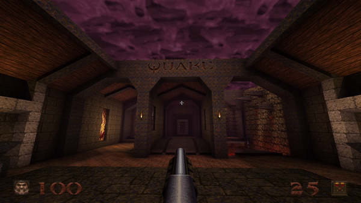
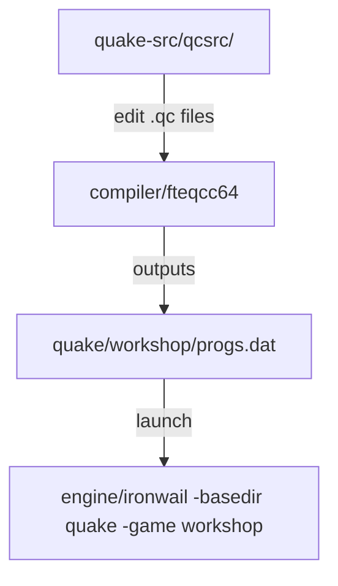

# Gameplay  -  QuakeC Programming

**What you'll make:** A working mod that changes how weapons, monsters, or items behave.

## Pipeline

## Start here  -  your first mod

Before anything else, make a change and see it in-game:

1. Open `quake-src/qcsrc/weapons.qc`. Find `T_MissileTouch` and change the radius damage value in the `T_RadiusDamage` call  -  make it absurdly large or small.
2. Compile: see `compiling_quakec.md` for your platform. Output goes directly to `quake/workshop/progs.dat`.
3. Launch: `engine/ironwail -basedir quake -game workshop`
4. Fire a rocket. You changed the game.

## Learning path

1. `compiling_quakec.md`  -  compile your first `progs.dat`
2. `quakec_basics.md`  -  code structure and naming conventions
3. Pick **one target** and go deeper  -  weapon behavior, monster stats, a new item effect
4. Compile -> launch -> test -> repeat

**Reference guides**

- `quakec_fields.md`  -  entity fields
- `quakec_globals.md`  -  global variables
- `builtin_functions.md`  -  engine built-in functions
- `quakec_basics.md`  -  language basics and good practices
- `modding_tutorials.md`  -  categorized list of example mods to build from
- `modding_links.md`  -  community resources

---

# Gameplay Programming: QuakeC

QuakeC is compiled by FTEQCC into a `progs.dat` file read by the engine's virtual machine. It is server-side only  -  all game logic (weapons, monsters, items, triggers) runs here.

## Mod directory

`quake/workshop/` is your mod directory. Files here load at higher priority than `id1/`  -  anything you don't replace still comes from the base game. The QuakeC source is in `quake-src/qcsrc/`.

**A note on pak archives:** pak files load in numeric order (`pak0.pak`, `pak1.pak`...). Keep your mod's pak count low  -  the engine has a limit of 7 total across `id1` and your mod.

**On reusing content:** If you borrow assets from other mods, make sure the source uses a permissive license (GPL, CC0, etc.). The game data in `quake/id1/` is [LibreQuake](https://github.com/MissLav/LibreQuake) and is GPL-licensed  -  free to modify and redistribute under the same terms.