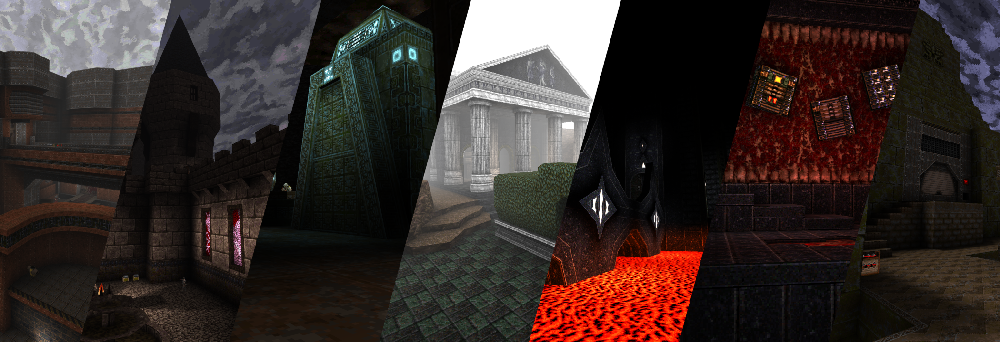
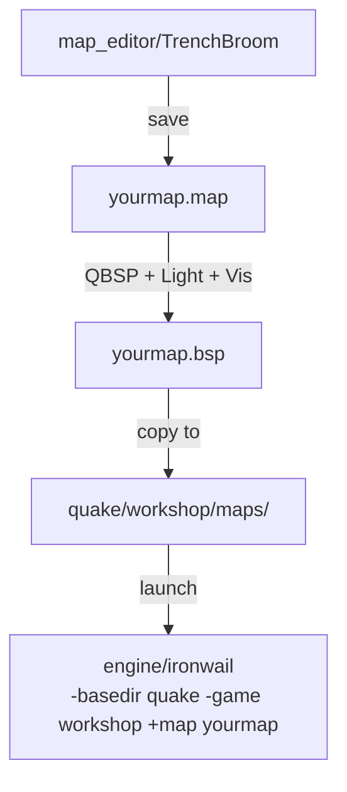

# Presentation  -  Level Design

Presentation is about **spatial design**: how spaces feel to move through, how encounters are staged, how the player is guided without being told where to go. Visuals serve design  -  not the other way around.

**What you'll make:** A playable map with rooms, lighting, and interactive entities.

## Pipeline

## Start here  -  your first map

Before anything else, get a working map in-game:

1. Open TrenchBroom. In **View > Preferences**, set your Quake path to the `quake/` folder  -  this loads textures and entity models automatically.
2. Build one sealed room  -  6 brushes (floor, ceiling, 4 walls). Make it roughly 256x256x128 units.
3. Place an `info_player_start` entity inside it.
4. Place one `light` entity. Set key `light` = `200`.
5. Compile with QBSP only, copy the `.bsp` to `quake/workshop/maps/`, launch: `engine/ironwail -basedir quake -game workshop +map yourmap`
6. You're in. Now iterate.

## Learning path

1. Follow the tutorial below end-to-end  -  it covers every tool and step you need
2. Add a weapon pickup, a monster, and a trigger message
3. Add a second room connected by a doorway
4. Revisit lighting: guide the player toward exits, hide danger in shadow
5. Final compile with Light + Vis and playtest the full loop

## Tutorial series  -  additional resource

**Quake Mapping** by dumptruck_ds  -  a comprehensive series covering TrenchBroom from first launch to advanced techniques. Some videos overlap with other domains (textures, sounds, mods)  -  that's expected, GD domains are intertwined.

Full playlist: [youtube.com/playlist?list=PLgDKRPte5Y0AZ_K_PZbWbgBAEt5xf74aE](https://www.youtube.com/playlist?list=PLgDKRPte5Y0AZ_K_PZbWbgBAEt5xf74aE)

Good starting points for this domain:
- [TrenchBroom 2 Quickstart](https://www.youtube.com/watch?v=gONePWocbqA)
- [Entities Part 1](https://www.youtube.com/watch?v=gtL9f6_N2WM) / [Part 2](https://www.youtube.com/watch?v=n8Ha5LHsRZI) / [Part 3](https://www.youtube.com/watch?v=TQ8MN8V0JuE) / [Part 4](https://www.youtube.com/watch?v=1bRnCga0gNo)
- [Lighting Basics](https://www.youtube.com/watch?v=pG39-SLgazs)
- [Clip Brushes](https://www.youtube.com/watch?v=pIFaiRCqres)
- [My Workflow Part 1](https://www.youtube.com/watch?v=ljkv3R3P0pA) / [Part 2](https://www.youtube.com/watch?v=35po5v1-mzk) / [Part 3](https://www.youtube.com/watch?v=Xl-wKsTCJ3E)

## Reference guides

- `entity_guide.md`  -  all Quake entities and their keys/values
- `map_compiling.md`  -  what QBSP / Light / Vis each do and when to run them
- `map_metrics.md`  -  performance limits and spatial scale guidelines
- `mapping_tools.md`  -  TrenchBroom and compile tool setup
- `mapping_links.md`  -  community resources

---

This article is meant as a basic introduction to how a [Quake](https://quakewiki.org/wiki/Quake "Quake") level is constructed in the modern Quake editing software [TrenchBroom](https://quakewiki.org/wiki/TrenchBroom "TrenchBroom"). The goal is to teach a new level designer what goes into making a map, the terms used, what compiling is, and how to compile and play a created map. If you have ever created levels for the other Quake games, or for the Half-life/Source engine games, the basic terms of this will be familiar as they evolved from Quake.

## What's a map!?

A Quake level is created in level editing software specifically designed for the task. There are [several editors](https://quakewiki.org/wiki/Mapping_tools#Level_Editors "Mapping tools") available, and all of them create [.map files](https://quakewiki.org/wiki/Quake_Map_Format "Quake Map Format"). These.map files are used by Quake compilers to generate the final [.bsp file](https://quakewiki.org/wiki/Quake_BSP_Format "Quake BSP Format") levels that can be loaded by the Quake engine. Think of the.map file as a blueprint, and it contains instructions of how to make all the solid geometry of a level, and where all the lights and monsters and pickups should go. There are 2 major objects used to make these instructions: Brushes and Entities.

## Brush: Your basic building block!

A brush

Our basic building block for constructing a level is the [brush](https://quakewiki.org/w/index.php?title=brush&action=edit&redlink=1 "brush (page does not exist)"). All of our level's solid geometry will be constructed from brushes. But what do we mean by 'brushes'? The semi-technical definition in Quake level creation is that they are [convex](http://en.wikipedia.org/wiki/Convex) [polyhedrons](http://en.wikipedia.org/wiki/Polyhedron). The less technical definition is that they are 3D objects made of faces which cannot 'see' each other. Most commonly, you will use [cubes](http://en.wikipedia.org/wiki/Cube) or [cuboids](http://en.wikipedia.org/wiki/Cuboid), but know that any convex polyhedron is allowed.

It's ok if your head is spinning from reading all that, even if you don't fully understand that definition, using brushes in Quake editing software is easy, and the hard work of mathematically defining them is done for you, hidden away in the background. All you need to do is plop them down, and arrange them to make the walls and floors of your level!

## Entities: The life of the party

A few entities

So we have brushes to define our world's geometry... but it wouldn't be a Quake level without [weapons](https://quakewiki.org/wiki/Weapons "Weapons") and [monsters](https://quakewiki.org/wiki/Monsters "Monsters")! And [entities](https://quakewiki.org/wiki/Entity "Entity") are just that, they are any of the functional objects defined in the game code for you to place into your level.

There are 2 types of entities: Brush entities and Point entities. Brush entities are things like doors, platforms, and trigger volumes; they are any functional object which need brush geometry tied to them to do their job. Point entities are things like weapons, monsters, and lights; they are all objects which are just simply dropped into place (at a point) in the world.

Entities of both types have various properties that can be edited by the designer to modify specified effects on the entity. Each property is a combination of a 'key', which is the name of the properties, and it's 'value'. As an example, light entities have a key called 'light', and its value is set to whatever brightness you want the light to be.

## Textures Wads and Compilers

Some textures

To round out our definitions, let me also talk about some external things we will need along with our.map file to create our final.bsp level.

Each face of a brush is allowed 1 [texture](https://quakewiki.org/wiki/Textures "Textures"), which can be rotated, scaled, and translated. But where do we get our textures? They are stored in [.wad files](https://quakewiki.org/wiki/Texture_Wad "Texture Wad"), which are a collection of textures to be used in levels. If you are familiar with older Doom/Doom2 level design, these are NOT the same as their [WAD files](http://doomwiki.org/wiki/WAD), despite having the same name.

We also need [compilers](https://quakewiki.org/wiki/Map_compiling "Map compiling"), which take our raw.map file and turn it into a.bsp file which Quake can load. There are 3 compilers which are used: [QBSP](https://quakewiki.org/wiki/QBSP "QBSP"), which turns the.map into a.bsp. [Light](https://quakewiki.org/wiki/Light_\(map_compiling\) "Light (map compiling)"), which calculates all the lighting information in the.bsp using our.map's instructions. And [Vis](https://quakewiki.org/wiki/Vis "Vis"), which calculates visibility in the level to optimize Quake's rendering.

## Tools of the trade

Everything you need is already in the workshop folder:

**Editing Software**: `map_editor/TrenchBroom`

**Textures**: TrenchBroom will load Quake's textures automatically once you set your Quake path in **View > Preferences**  -  no separate WAD download needed.

**Map compile tools**: ericw-tools (QBSP, Light, Vis)  -  provided in `map_editor/`. Extract for your platform, then configure TrenchBroom's compile dialog (**Run > Compile**). See `mapping_tools.md`.

## Putting it together

Now that we have definitions out of the way, let's open up Trenchbroom and actually build a simple level.

## Some setup

Trenchbroom

When you first open Trenchbroom, you should have something much like the image on the right, but before we dive into some editing, there's a couple of things to set up. First, you likely won't see the little [Quakeguy](https://quakewiki.org/wiki/Quakeguy "Quakeguy") models, or any of the entity models, in the lower right section of your Trenchbroom in the Entity Browser. To fix this, go to **View>Preferences...** and set your Quake Path to where your Quake is installed (ex: C:\\Quake\\). Once you've set this, Trenchbroom will remember it for all future maps you make. Other settings here include OpenGL display settings, and Mouse sensitivity and axis inverting if you wish to modify these.

Once the Quake path is set, textures load automatically from the game files. Click on the **Face tab** in the upper right of TrenchBroom  -  you should see all the Quake textures in the browser.

## Painting the town

Applying Textures

Now we're ready to begin our map. Our brush is currently a sad, untextured grey. Let's fix that by putting a texture on it. **Select the brush** in the 3D view by **Left Clicking** on it, it will shade red when selected, and show some 'laser lines' extending from it's bounds. Now, let's put a texture on it. We're going to make this a floor, so find a good floor texture in the browser and **Left Click** on it to **apply** it. I'm using *city4\_2*.

You can **select a single face** of a brush by **Shift-Left Clicking** a face, and **select multiple faces** by **Ctrl-Shift-Left Clicking**. In the upper right of Trenchbroom, we can also choose to offset, scale, or rotate this texture on our brush. Textures dimensions Quake must be [powers of 2](http://en.wikipedia.org/wiki/Power_of_two), often 64x64 or 128x128, so you will generally shift them by 1, 2, 4, 8, 16, 32, or 64 units. Scale is a multiplier, so to make textures 'smaller' you will use numbers smaller than 1, such as 0.5 for half-scale. Scale can also be use to mirror a texture, so a scale of -1 will flip it. Rotation is in degrees, 0-360, and negative values are allowed.

## Making some room

Resizing brushes

Our floor is a little small, let's make it a bit larger, and also familiarize ourselves with the 3D view a bit. To **look around** in the 3D view, **Right Click and Hold** in the 3D view while dragging your mouse. To **pan** left/right up/down, **Middle Click and Hold** in the 3D view. You can also **orbit** the camera by pressing **Alt-Right Click and Hold**.

Now, let's resize our floor brush. To do this, the brush must be selected, so reselect it if it is not or you only have some of it's faces selected. Now, **Hold down Shift** to enter face dragging mode and display the brush's dimensions. You will notice as you mouse over different parts of your brush, their edges will turn white, while continuing to **Hold down Shift**, you may **Left Click and Drag** a white face. Let's make our floor 256x256 wide and 16 units tall. You will notice that when resizing, you are constrained to 16 unit increments. You can change the **Grid Size** with **Ctrl--** and **Ctrl-+**, which will decrease or increase the grid by a power of 2, though it is recommended to stick to 16 units for this tutorial.

## A new brush

Creating new brushes

Until now, we've only worked with the brush that Trenchbroom created for us, but now we want to make a wall, so we need a new brush. First, let's **Deselect** our floor by either **clicking in the black void**, or by pressing **Ctrl-Shift-A**. Now, to make a new brush, **Left Click and Drag** in the 3D view. While continuing to **Hold Left Click**, you effect the newly created brush's height by **Scrolling the MouseWheel**. Don't be concerned if the brush is not perfectly sized or positioned, you can always edit it. To **Move a Brush**, all you need to do is **Left Click and Drag** a selected brush. Let's position our wall at one of the edges of our floor, and size it 256x16x128 as shown in the picture to the right. Make sure the edges are perfectly aligned as we put brushes together. Also, give it a nice wall texture, I am using *city2\_8*.

## Even more brushes

Duplication

Let's keep going with constructing our room. To make another wall, let's **Duplicate** the wall we already have by selecting it, and pressing **Ctrl-D**. Now position it on the opposite edge of our floor. Let's also make a ceiling, so select the floor, and duplicate it as well. Now, we need our brush to **Move Vertically**, and for that, we **Hold down Alt** whilst moving our brush, notice your cursor changes to 2 arrows pointing up and down. Let's give this a nice ceiling texture, I am using *city5\_3*.

Although not pictured to the right, let's close up our room now. **Select Multiple Brushes** by **Ctrl-Left Clicking** them, and select both of our walls. Duplicate them, and let's rotate them. You can quickly **Rotate 90 degrees Horizontally** by pressing **Alt-Left Arrow** and **Alt-Right Arrow**. You can also **Rotate 90 degrees Vertically** by pressing **Alt-Up Arrow** and **Alt-Down Arrow**. You can also **Flip Horizontally** with **Ctrl-F** and **Flip Vertically** with **Ctrl-Alt-F**.

Again, make sure all of our brushes have their edges aligned so our room is sealed. For our simple room this is not the end of the world if they are not, but it is good habit to get started with and will be required on larger, more complex maps to ensure they do not [leak](https://quakewiki.org/w/index.php?title=leak&action=edit&redlink=1 "leak (page does not exist)"). Leaks occur when your brushes don't form a complete seal around the playable world, and prevent the compiling process Vis from running.

## Add some functionality

Our first entity

Now that we have a closed room, let's do some work so we can use it. The first thing to do is make a place for the player to start the level at. Go to the Entity tab in Trenchbroom, and scroll down a little in the Entity Browser on the bottom right of the editor. Find the model of Quakeguy with the words **info\_player\_start** under it. **Left Click and Drag** it into your 3D view to place it. info\_player\_start is an entity which does not need any more set up than that to work!

You do not always have to use the entity browser to make entities. You could also have done this by **Right Clicking** in the 3D view, and navigating the menu **Create Point Entity>Info>Player\_start**.

## Lights and Properties

Setting Properties

Technically we could compile and try our map now, but let's add some more stuff to our map first. How about a light? Either drag the entity **Light** from the entity browser, or in the **Right Click Menu** select **Create Point Entity>Light>Light**. Move this somewhere in the center of our room. Now, we do actually need to modify this entity for it to work right. With the light still selected and the Entity tab open, notice in the upper right corner of Trenchbroom our entity's keys and values. Trenchbroom, as of this writing, only puts some very basic keys and values into entities, so for now you will want to refer to the [Entity Guide](https://quakewiki.org/wiki/Entity_guide "Entity guide") for all the keys and values you may need on your entities.

We want to set the brightness of our light. To do this, we need a **New Key**. Click on the **\+ button** next to our list of keys, and rename our newly created key "light" and set it's value to "200".

## Triggers!

Making a Trigger

Let's also make sure everyone knows how great Quake is by telling them. To do this, we're going to make a brush entity that when the player walks into it, it displays a message. First, we need to make a brush as normal. This is going to be a trigger, a type of brush entity that is invisible and nonsolid, so it doesn't matter what texture is on our brush, but general convention is to use the texture *trigger*. Now, **Right Click** with our brush still selected, and go to **Create Brush Entity>Trigger>Multiple**. You should now see the text 'trigger\_multiple' over our brush. Add some keys to this entity, "Message" with the value "Quake is Great!", and "wait" with the value "5". Message is the text we will display to the player, wait is how long the game should wait between triggering again so we aren't spamming our message constantly.

## Time to compile!

Save your map with **File > Save** or **Ctrl-S**. Open TrenchBroom's compile dialog: **Run > Compile**. You'll need ericw-tools configured here  -  add a compile profile with three tasks in order: `qbsp`, `light`, `vis`, each pointing to the respective ericw-tools executable. Set the output path to `quake/workshop/maps/`.

Once configured, you can run any subset of the tools: run only QBSP for a quick geometry check, add Light when you want to see shadows, run full QBSP + Light + Vis for a final build.

## QBSP

Our map in game!

In TrenchBroom's compile dialog (**Run > Compile**), run only the QBSP task first. Once it finishes, copy the `.bsp` to `quake/workshop/maps/` and launch `engine/ironwail -basedir quake -game workshop +map yourmap`.

If you've been paying attention, you shouldn't be surprised to see that your map is a fully bright box with no shadowing. This is because we have only run QBSP on our.map. QBSP turns all our brushes into polygons which are nicely organized for Quake into a format called.bsp, in a process called [Binary Space Partitioning](http://en.wikipedia.org/wiki/Binary_space_partitioning).

QBSP is also responsible for taking your textures out of your .wad and compiling them into the .bsp. This means you do not need to supply a .wad alongside your level when sharing it.

See [QBSP](https://quakewiki.org/wiki/QBSP "QBSP") for more information and common command-line arguments.

## Light

Light and Shadow

Once you're done examining the fully-bright room, go back to TrenchBroom's compile dialog, run the Light task, copy the updated `.bsp`, and relaunch. Your map is now shadowed.

General lighting in Quake is not dynamic  -  it is baked by the light compiler into lightmaps stored in the .bsp file. Light can take a while on complex maps, so when testing geometry or entity placement you can skip it and run QBSP only. If you have no light entities in your map and run light, your map will be fully dark.

See [Light (map compiling)](https://quakewiki.org/wiki/Light_\(map_compiling\) "Light (map compiling)") for more information and common command-line arguments.

## Vis

No PVS

PVS

You can now compile with Vis if you'd like. Unfortunately, our little single room map is a bit too simple to actually show what it does. Vis is a process which computes visibility of areas, and creates a table known as the [Potentially Visible Set](http://en.wikipedia.org/wiki/Potentially_visible_set) (often shortened to PVS), which Quake uses to determine areas which the player cannot possibly see, and thus, does not need to render. Note that brush entities (or any entities), such as doors or triggers, do not block Vis, nor do special brushes like clips or liquids. Only solid brush geometry.

In Ironwail you can visualize this with `r_showtris 1` in the console  -  it outlines every rendered polygon. Without Vis, polygons around corners that the player cannot see are still rendered. With Vis, they are culled. On a simple single-room map the savings are minimal, but as maps grow larger and more complex Vis becomes critical for performance.

Vis requires that a.bsp be fully sealed to run. This means that all of your entities must be surrounded by brushes, and cannot trace a line into the [void](https://quakewiki.org/wiki/void "void"). QBSP will warn you when a.bsp [leaks](https://quakewiki.org/w/index.php?title=leaks&action=edit&redlink=1 "leaks (page does not exist)") like this, and generate a [pointfile](https://quakewiki.org/wiki/pointfile "pointfile") which can be loaded in either Quake or Trenchbroom to help you find where you need to seal your level.

It should be noted that in general, Vis on a more complex map will be the compiling tool which takes the longest. Vis times are effected by the size of rooms, and the complexity of brushes. Large, open areas and very complex geometry can lead to massive compile times (days or weeks!) even on modern CPUs and are part of the reason why things like this are rare in Quake. When you are just starting out, it is advised to build areas the size and detail seen in stock Quake until you have a feel for how Vis times are effected.

See [Vis](https://quakewiki.org/wiki/Vis "Vis") for more information and common command-line arguments.