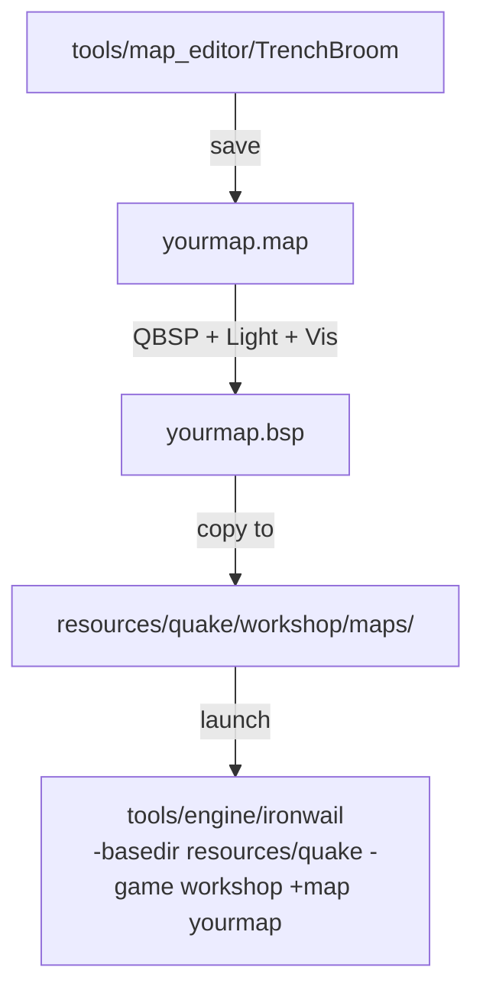

# Presentation  -  Level Design

Presentation is about **spatial design**: how spaces feel to move through, how encounters are staged, how the player is guided without being told where to go. Visuals serve design  -  not the other way around.

**What you'll make:** A playable map with rooms, lighting, and interactive entities.

To see more what can achieve checkout this video! [The Beauty of Quake](https://youtu.be/eheKKQdhCs4?si=5Qgxk4_JZR_Q1vfL)

## Pipeline

## Start here  -  your first map

Before anything else, get a working map in-game:

1. Open TrenchBroom. In **View > Preferences**, set your Quake path to the `resources/quake/` folder  -  this loads textures and entity models automatically.
2. Build one sealed room  -  6 brushes (floor, ceiling, 4 walls). Make it roughly 256x256x128 units.
3. Place an `info_player_start` entity inside it.
4. Place one `light` entity. Set key `light` = `200`.
5. Compile with QBSP only, copy the `.bsp` to `resources/quake/workshop/maps/`, launch: `tools/engine/ironwail -basedir resources/quake -game workshop +map yourmap`
6. You're in. Now iterate.

## Learning path

1. Follow `getting_started_mapping.md` end-to-end  -  it covers every tool and step you need
2. Add a weapon pickup, a monster, and a trigger message
3. Add a second room connected by a doorway
4. Revisit lighting: guide the player toward exits, hide danger in shadow
5. Final compile with Light + Vis and playtest the full loop

## Tutorial series  -  additional resource

**Quake Mapping** by dumptruck_ds  -  a comprehensive series covering TrenchBroom from first launch to advanced techniques. Some videos overlap with other domains (textures, sounds, mods)  -  that's expected, GD domains are intertwined.

Full playlist: [youtube.com/playlist?list=PLgDKRPte5Y0AZ_K_PZbWbgBAEt5xf74aE](https://www.youtube.com/playlist?list=PLgDKRPte5Y0AZ_K_PZbWbgBAEt5xf74aE)

Good starting points for this domain:
- [TrenchBroom 2 Quickstart](https://www.youtube.com/watch?v=gONePWocbqA)
- [Entities Part 1](https://www.youtube.com/watch?v=gtL9f6_N2WM) / [Part 2](https://www.youtube.com/watch?v=n8Ha5LHsRZI) / [Part 3](https://www.youtube.com/watch?v=TQ8MN8V0JuE) / [Part 4](https://www.youtube.com/watch?v=1bRnCga0gNo)
- [Lighting Basics](https://www.youtube.com/watch?v=pG39-SLgazs)
- [Clip Brushes](https://www.youtube.com/watch?v=pIFaiRCqres)
- [My Workflow Part 1](https://www.youtube.com/watch?v=ljkv3R3P0pA) / [Part 2](https://www.youtube.com/watch?v=35po5v1-mzk) / [Part 3](https://www.youtube.com/watch?v=Xl-wKsTCJ3E)

## Reference guides

- `entity_guide.md`  -  all Quake entities and their keys/values
- `map_compiling.md`  -  what QBSP / Light / Vis each do and when to run them
- `map_metrics.md`  -  performance limits and spatial scale guidelines
- `mapping_tools.md`  -  TrenchBroom and compile tool setup
- `mapping_links.md`  -  community resources

