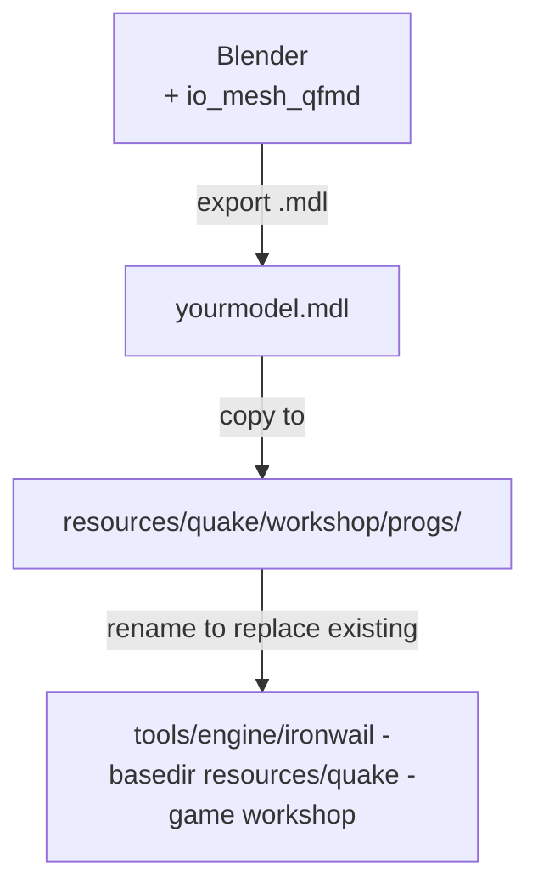
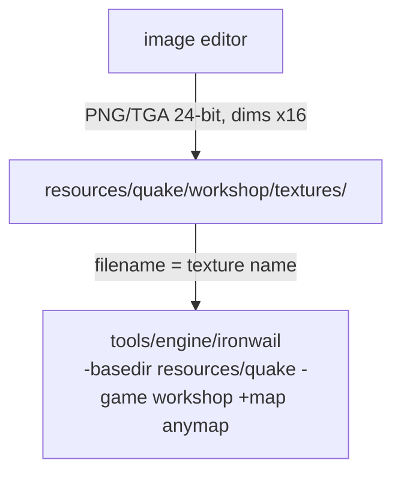

# Story  -  Asset Creation

Story covers everything that goes into the look and sound of the game: models, textures, sprites, sounds. Pick one path below and follow it through to seeing your asset in-game.

---

## Path A  -  Model

Replace or add a 3D model in the game.

### Pipeline

### Tutorial series  -  watch this first

**Modeling for Quake** by Fairweather  -  follow this series in order, using `tools/asset_editor/Blender` and the `io_mesh_qfmd` plugin already provided:

1. [Interface and Basic Navigation](https://www.youtube.com/watch?v=oSH03YZq2EA)
2. [Poly Modeling Basics](https://www.youtube.com/watch?v=aMj-pKcCVAI)
3. [Creating the Mesh](https://www.youtube.com/watch?v=AigfWLsog60)
4. [UV Mapping](https://www.youtube.com/watch?v=VAVUiRm3h1I)
5. [Texturing and Exporting](https://www.youtube.com/watch?v=_t_SY6JnTnA)
6. [Common Problems, Quirks and Solutions](https://www.youtube.com/watch?v=nZC-G9Tz6OM) <- read this before you get stuck

> The series uses Blender 2.8, but the provided Blender is 3.3  -  the UI is slightly different but all the tools are the same.

### Steps

1. Install the exporter plugin: **Edit > Preferences > Add-ons > Install**  -  select `tools/asset_editor/plugins/io_mesh_qfmd.zip`. Enable it.
2. Follow the tutorial series above to build, UV-map, texture, and export your model as `.mdl`.
3. Keep it low-poly  -  original Quake models are under 500 triangles.
4. Read `quake_palette.md` for skin coloring  -  pay attention to fullbright colors.
5. The fastest way to see your model in-game: **rename it to replace an existing one**  -  e.g. `soldier.mdl` replaces every soldier.
6. Drop it in `resources/quake/workshop/progs/`.
7. Launch: `tools/engine/ironwail -basedir resources/quake -game workshop`

---

## Path B  -  Texture

Replace an existing surface texture in the game with your own artwork.

### Pipeline

### Steps

1. Read `making_textures.md`  -  pay attention to dimension rules and special texture prefixes.
2. Read `quake_palette.md`  -  you can work in full color since Ironwail loads external textures directly, but staying close to the palette keeps things cohesive.
3. Create your texture in any image editor. Export as `.png` or `.tga` (24-bit). **Both dimensions must be multiples of 16** (e.g. 64x64, 128x64).
4. Find the name of the texture you want to replace. Open any map in TrenchBroom  -  texture names are visible in the face properties panel.
5. Name your file to match exactly (e.g. `city4_2.png` replaces the `city4_2` texture).
6. Drop your file in `resources/quake/workshop/textures/`.
7. Launch: `tools/engine/ironwail -basedir resources/quake -game workshop +map anymap`

**Reference:** `making_textures.md`, `quake_palette.md`

---

## Path C  -  Sound

Replace or add a sound effect.

### Steps

1. Read `making_sounds.md`  -  Quake expects **mono WAV, 11025 Hz, 8-bit** for best compatibility.
2. Record or create your sound in any audio editor and export as `.wav` matching those specs.
3. Find the path of the sound you want to replace. The game sounds are in `resources/quake-src/lq1/sound/`  -  browse that folder to find the right file and path.
4. Create the matching folder under `resources/quake/workshop/sound/` and drop your `.wav` there (e.g. `resources/quake/workshop/sound/weapons/rocket.wav`).
5. Launch: `tools/engine/ironwail -basedir resources/quake -game workshop`

**Reference:** `making_sounds.md`
